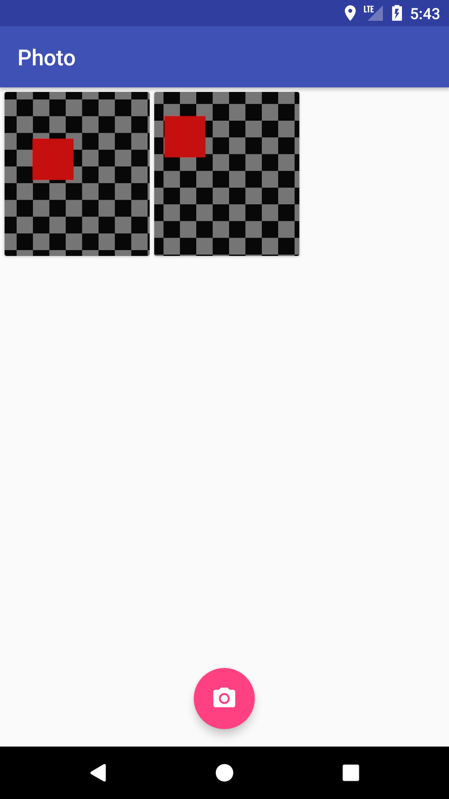
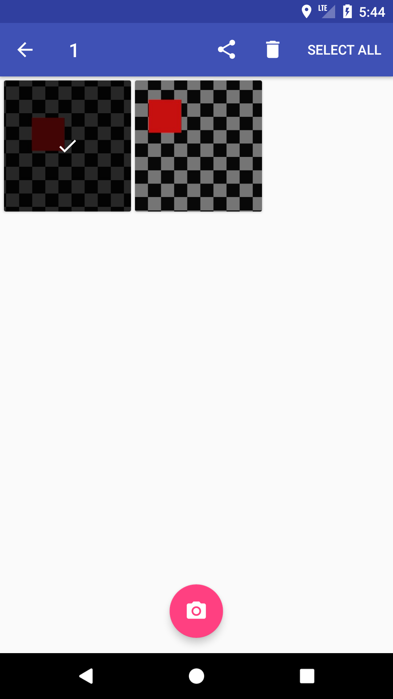
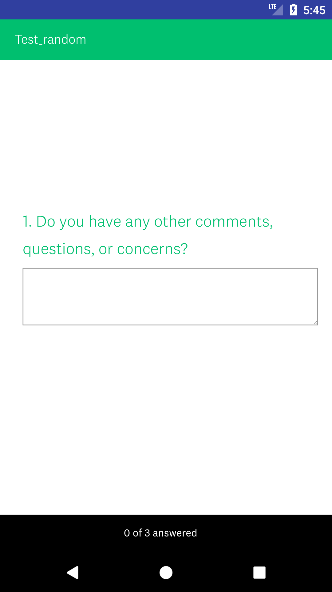

# Photo (BETA)

A gallery&camera app.

It covers:

1.  Use RecyclerView and ViewPager implement seamless interaction between gallery and scrollable detailed image interfaces.
2.  Use Fragments to control the content.
3.  Use AsyncTaskLoader instead of AsyncTask to load local images from specific folder.
4.  User MediaStore to scan local images.
5.  Support multi-selection on the gallery screen.
6.  Use SurveyMonkey API to send survey after a triger time.
7.  Use Smart Location to grab GPS location data.
8.  More features are under construction...

## Reference + Tutorial

* Interface:
  * [ImageView ScaleType](https://robots.thoughtbot.com/android-imageview-scaletype-a-visual-guide)
  * [Gallery <-> Detailed Image](http://blog.iamsuleiman.com/android-image-gallery-app-gestures-transition/)
  * [Call Local Camera](https://developer.android.com/training/camera/photobasics.html)
* Storage
  * [Loade Lifecycle](https://stackoverflow.com/questions/25234581/what-does-asynctaskloader-deliverresult-actually-do)
  * [Extra Data From MediaStore](https://github.com/bumptech/glide/tree/master/samples/gallery)
  * [Add Data to MediaStore](https://stackoverflow.com/questions/21822759/how-to-add-taken-photo-to-mediastore)
  * [Require Permission](https://developer.android.com/training/permissions/requesting.html)
* Communication
  * [Among Fragments](https://learnpainless.com/android/how-to-get-fragment-from-viewpager-android)
  * [Between Fragment and Adapter](http://droidmentor.com/multi-select-like-whatsapp-android/)
* Other
  * [Resources](https://github.com/rexstjohn/UltimateAndroidCameraGuide)

## Libraries Used

1.  [Glide](https://github.com/bumptech/glide) – By @bumptech
2.  [ButterKnife](https://github.com/JakeWharton/butterknife) – By @JakeWharton
3.  [PhotoView](https://github.com/chrisbanes/PhotoView) – By @chrisbanes
4.  [Smart Location Library](https://github.com/mrmans0n/smart-location-lib) – By @mrmans0n

## License

    Copyright 2018 Zirui Wang

    Licensed under the Apache License, Version 2.0 (the "License");
    you may not use this file except in compliance with the License.
    You may obtain a copy of the License at

    http://www.apache.org/licenses/LICENSE-2.0

    Unless required by applicable law or agreed to in writing, software
    distributed under the License is distributed on an "AS IS" BASIS,
    WITHOUT WARRANTIES OR CONDITIONS OF ANY KIND, either express or implied.
    See the License for the specific language governing permissions and
    limitations under the License.
